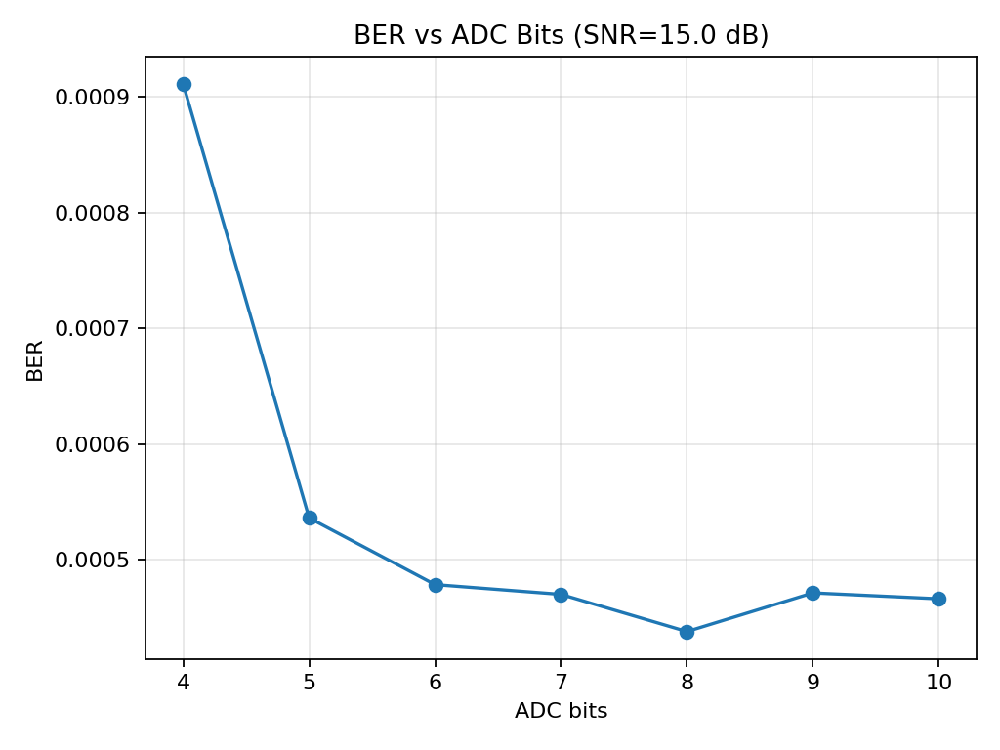
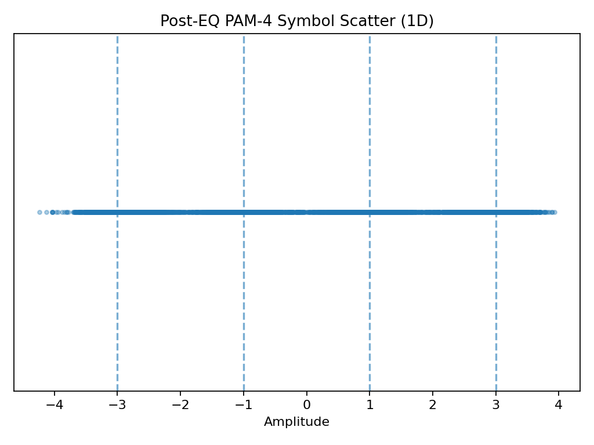
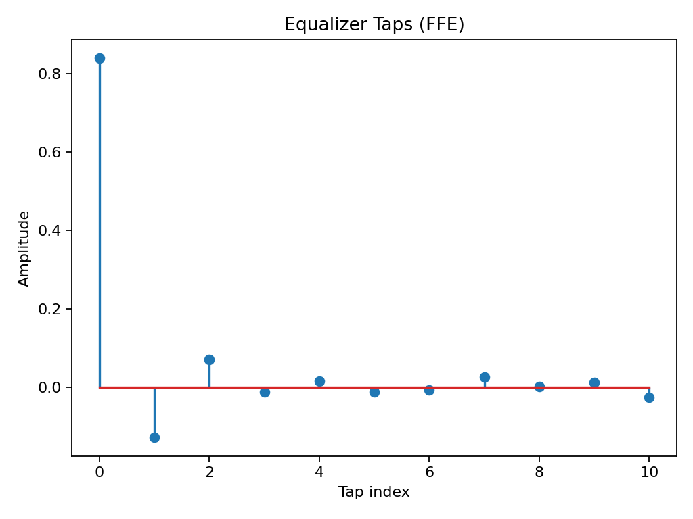

# PAM-4 Image Transmission (Python)

This project implements an end-to-end PAM-4 image transmission system to study how communication impairments affect real image data. The goal is to bridge concepts from digital communication and signal integrity with practical image-level validation.

---

## Project Overview

In this project, an RGB image is:
1. Converted into a binary bitstream
2. Mapped to PAM-4 symbols
3. Transmitted through a noisy and ISI-impaired channel
4. Quantized using a finite-resolution ADC
5. Equalized and demodulated at the receiver
6. Reconstructed back into an image

Performance is evaluated using **BER (Bit Error Rate)** and **PSNR (Peak Signal-to-Noise Ratio)**.

---

## System Features

- PAM-4 modulation and demodulation
- Root Raised Cosine (RRC) pulse shaping
- Inter-symbol interference (ISI) channel modeling
- Additive white Gaussian noise (AWGN)
- ADC quantization (configurable bit resolution)
- Timing phase selection
- Linear equalization
- BER and image-quality evaluation

---
## System Flow

1. Load input RGB image  
2. Convert image pixels into a binary bitstream  
3. Group bits and map them to PAM-4 symbols (2 bits per symbol)  
4. Apply Root Raised Cosine (RRC) pulse shaping  
5. Transmit the signal through a channel with:
   - Additive White Gaussian Noise (AWGN)
   - Inter-Symbol Interference (ISI)
6. Receiver processing includes:
   - Matched filtering
   - Optimal sampling phase selection
   - PAM-4 symbol detection
   - Bit reconstruction
7. Reconstruct the image from recovered bits  
8. Evaluate performance using BER and PSNR  
9. Generate plots and image comparison results  
 ---

## Example Run Configuration

- Image size: **512 × 512 RGB**
- Modulation: **PAM-4**
- SNR: **15 dB**
- ADC resolution: **8 bits**
- Oversampling factor: **8 samples/symbol**
- RRC roll-off factor: **0.25**
- ISI channel taps: [0.85, 0.35, -0.18, 0.08]

---
### Channel & Receiver Parameters

- ISI channel taps: [0.85, 0.35, -0.18, 0.08]
- Pulse shaping: Root Raised Cosine (RRC)
  - Roll-off factor (β): 0.25
  - Filter span: 10 symbols
- Receiver equalizer: Linear FFE
- Timing recovery: Best sampling phase selected (0–7)
---

## Key Results

- **Bit Error Rate (BER):**  
  `4.69 × 10⁻⁴`

- **Image Quality (PSNR):**  
  `39.9 dB`

Despite channel noise and quantization, the reconstructed image maintains high visual fidelity, with errors appearing sparsely and without structural distortion.

---

### BER vs SNR


### BER vs ADC Resolution


### PAM-4 Symbol Distribution (Post-Equalization)


### Equalizer Tap Weights



---

## Image-Level Validation

### Original vs Reconstructed Image

| Original Image | Reconstructed Image |
|---------------|---------------------|
|  |  |


### Error Localization


The error map highlights pixel locations affected by bit errors, demonstrating how physical-layer impairments translate into localized image artifacts.

---

## Why This Project Matters

This project demonstrates how:
- Physical-layer impairments impact real data
- ADC resolution and SNR trade-offs affect system performance
- Communication metrics (BER) relate to perceptual quality (PSNR)

The workflow reflects challenges encountered in **high-speed serial links, wireline communication, and image data transmission systems**.

---

## How to Run

```bash
python3 pam4_image_link_industry.py --image input.png --snr_db 15 --adc_bits 8
python3 pam4_image_link_industry.py --image input.png --do_sweeps
```
---
> *Image Source Note*  
> *The input image used in this project was obtained from publicly available web sources and is used solely for academic, non-commercial, and demonstration purposes.*  
>  
> *All signal processing, transmission, receiver modeling, and reconstructed outputs shown in this repository were generated by the author using the implemented PAM-4 communication pipeline.*
